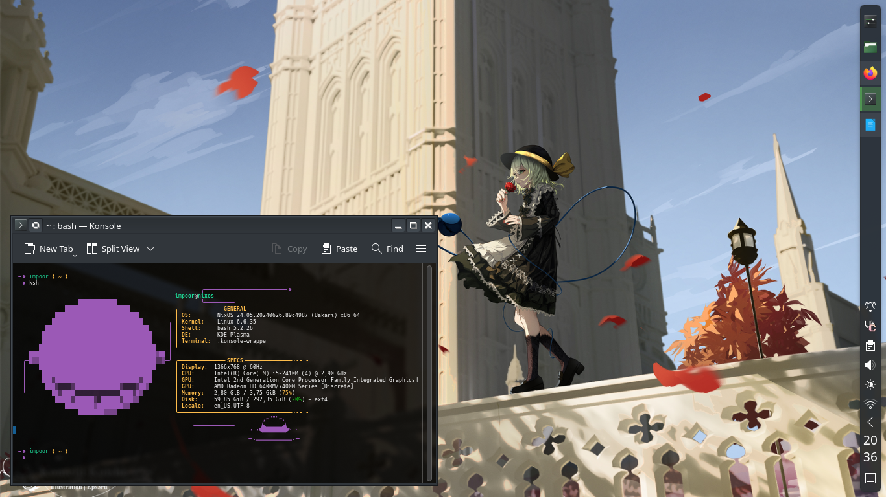
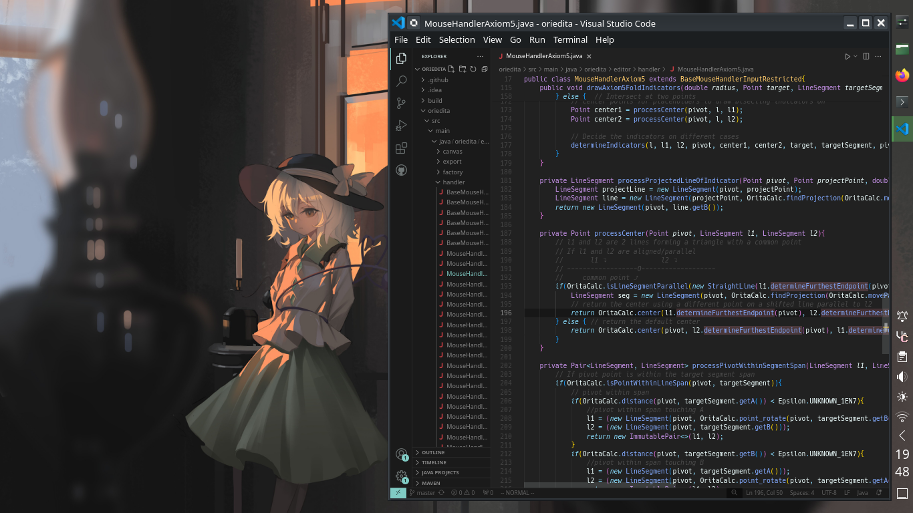

# The most boring NixOS configuration ever

Featuring:
- Built-in KDE Plasma 6 with its configs installed using konsave because either I'm stupid or there's no easy way to configure it declaratively.
- Customized fastfetch that I spent way too much time doing by hand
- Fresh-outta-the-udder vim that I barely use because learning curve is an annoying trollop
- Other barebone module installations with little to no customizations
- Koosh
- More Koosh
- and a few more Koosh (slideshow wallpaper)

> [!NOTE]
> The author source for all the wallpaper images are all in [here](assets/ksh-bg-imgs) as part of the file names (searchable in Pixiv).

## Previews (why do you even care about this):

